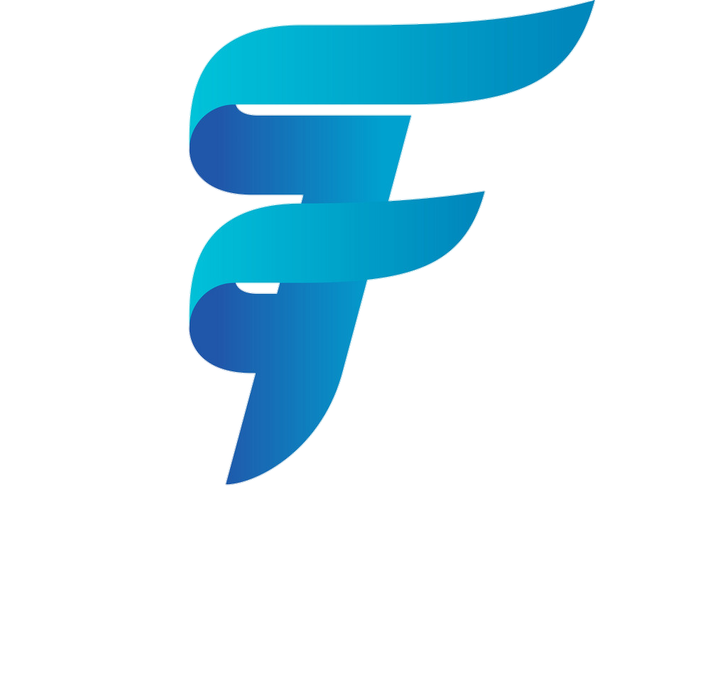
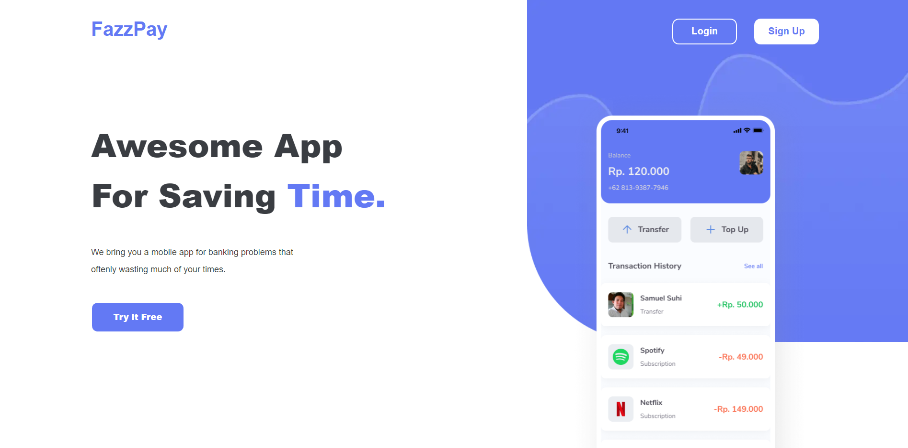
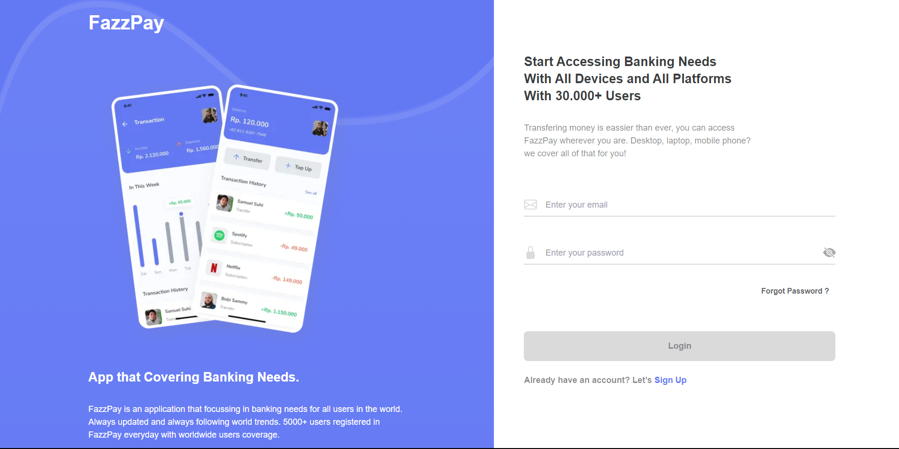
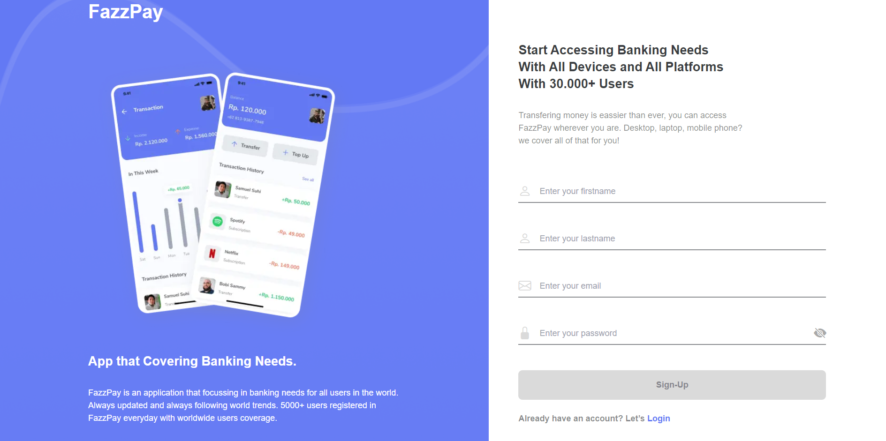
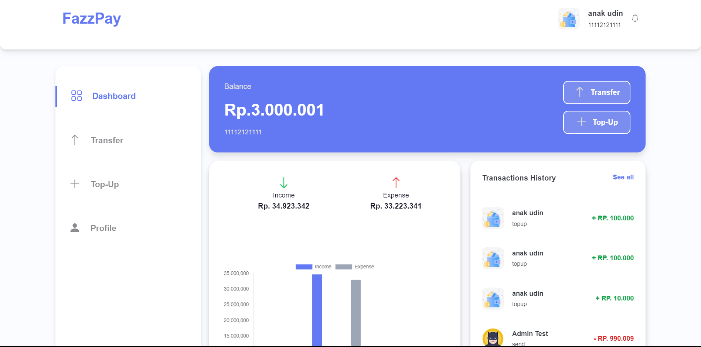

<a id="readme-top"></a>

<!-- PROJECT LOGO -->
<br />
<div align="center">
  <a href="#">
    
  </a>

  <h2 align="center">FAZZPAY E-WALLET</h2>
  


  <p align="center">
    <a href="https://fazzpay-e-wallet.vercel.app/">View Demo</a>
    ·
    <a href="#">Report Bug</a>
    ·
    <a href="#">Request Feature</a>
  </p>
</div>

## About The Project

<!-- ![Product Name Screen Shot][product-screenshot] -->

FazzPay is a cutting-edge digital wallet application that revolutionizes the way people make payments, transfers, and manage their finances. Designed with user convenience and security in mind, FazzPay offers a seamless and hassle-free experience

<p align="right">(<a href="#readme-top">back to top</a>)</p>

<!-- ## Built With

<p align="center">
  <a href="https://skillicons.dev">
    
  </a>
</p>

<p align="right">(<a href="#readme-top">back to top</a>)</p> -->

### Built With

- [![Next][Next.js]][Next-url]
- [![React][React.js]][React-url]
- [![Tailwind][Tailwind-CSS]][Tailwind-url]
- [![Redux][Redux]][Redux-url]

## Contents

- [Features](#features)
- [Run Application](#how-to-run-the-application)
- [Deployment](#deployment)
- [Related Projects](#related-projects)
- [Contributors](#contributors)

## Features

### Public

- Login
- Register
- Forgot Password
- Transfer
- Transfer History
- Edit Profile
- Dashboard
- Etc

## How to Run the Application

### 1. Clone this repository

Clone this repository by run the following code:

```
$ git clone https://github.com/yanu-setiawan/Fazzpay-NextJs.git
```

### 2. Install dependency packages

Install dependency packages by run the following code inside project folder:

```
$ npm install
```

### 3. Configure .env file

Configure .env file by create file named .env inside project folder and add this line to the file:

```
NEXT_PUBLIC_BACKEND_URL = "https://example.com"

NEXT_PUBLIC_URL_PAGE = "https://example.com"

NEXT_PUBLIC_IMAGE = "https://example.com"

```

### 4. Run projects

Run this projects by run the following code:

```
$ npm run dev
```

It runs the app in the development mode.\
Open [http://localhost:3000](http://localhost:3000) to view it in your browser.

The page will reload when you make changes.\
You may also see any lint errors in the console.

## Deployment

[Vercel deploy link](fazzpay-e-wallet-67oyyxyfr-yanu-setiawan.vercel.app)

<p align="right">(<a href="#readme-top">back to top</a>)</p>

## Contributing


1. Fork the Project
2. Create your new Branch ( `git checkout -b ...` )
3. Commit your Changes ( `git commit -m '...'` )
4. Push to the Branch ( `git push origin ...` )
5. Open a Pull Request


<p align="right">(<a href="#readme-top">back to top</a>)</p>

## Deployment

[Vercel deploy Link](https://fazzpay-next-js.vercel.app/)

<p align="right">(<a href="#readme-top">back to top</a>)</p>

## Documentation

<p align="center" style="gap:2%">




</p>


<p align="center"> <samp><i>&copy; yanusetiawan </i></samp> </p>


[Next.js]: https://img.shields.io/badge/next.js-000000?style=for-the-badge&logo=nextdotjs&logoColor=white
[Next-url]: https://nextjs.org/
[React.js]: https://img.shields.io/badge/React-20232A?style=for-the-badge&logo=react&logoColor=61DAFB
[React-url]: https://reactjs.org/
[Tailwind-CSS]: https://img.shields.io/badge/tailwindcss-%2338B2AC.svg?style=for-the-badge&logo=tailwind-css&logoColor=white
[Tailwind-url]: https://tailwindcss.com/
[Redux]: https://img.shields.io/badge/redux-%23593d88.svg?style=for-the-badge&logo=redux&logoColor=white
[Redux-url]: https://redux.js.org/
